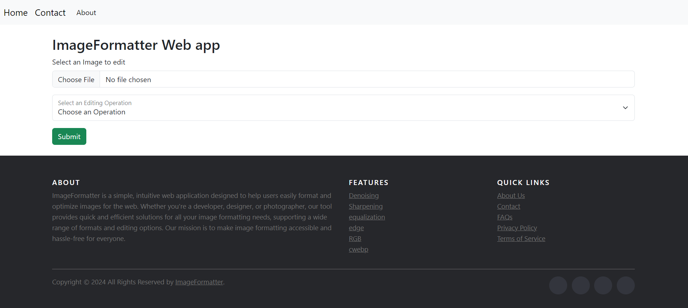

# ImageFormatter Web App

ImageFormatter is a simple and intuitive web application designed to help users easily format and optimize images for the web. Whether you're a developer, designer, or photographer, this tool provides quick and efficient solutions for all your image formatting needs, supporting a wide range of formats and editing options.


## Features

- Denoising: Reduce image noise and enhance clarity.
- Sharpening: Increase the sharpness of images for better detail.
- Equalization: Improve image contrast and brightness.
- Edge Detection: Identify edges within an image for better visualization.
- RGB Manipulation: Adjust RGB channels individually for color correction.
- cwebp Conversion: Convert images to the WebP format for optimized web use.


## Installation

To get started with the ImageFormatter web app, follow these steps:
1) Clone the repository:

```bash
git clone https://github.com/SadabAli/ImageFormatter.git
cd ImageFormatter

```
2) Install the required dependencies:

Install the dependencies from the requirements.txt file:
```bash
pip install -r requirements.txt

```
3) Run the application:
Start the Flask development server:
```bash
python app.py

```
Open your web browser and go to http://127.0.0.1:5000/ to access the web app.
## License

This project is licensed under the MIT [MIT](https://choosealicense.com/licenses/mit/) License - see the LICENSE file for details.


## Authors

- [@mirsadabali](https://github.com/SadabAli)

<h1>Screenshot</h1>

